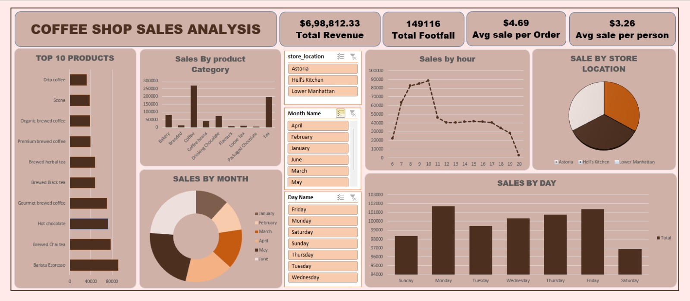

# Coffee-sales-dashboard
Excel dashboard for coffee shop sales analysis
# ☕ Coffee Shop Sales Dashboard

## 📊 Overview

This project contains an Excel-based dashboard analyzing coffee shop sales data.

## 🔹 Key Insights

* Total Revenue: $698,812
* Total Footfall: 149,116
* Average Sale per Order: $4.69
* Average Sale per Person: $3.26

## 📈 Features

* Sales by Product Category
* Top 10 Products
* Sales by Month, Day, and Hour
* Store Location Analysis

## 🛠 Tools Used

* Microsoft Excel
* Pivot Tables
* Charts & Slicers

## 📷 Dashboard Preview

## 📂 Files Included

* `coffee_sales_dashboard.xlsx`
* `dashboard.png`

## 🚀 How to Use

Download the Excel file and open in Microsoft Excel to interact with filters and slicers.
